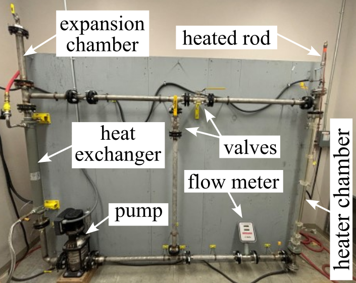

# CORE²S
## Control-Oriented Research Environment for Energy Systems

A physical and digital testbed for experimenting with thermal, fluid, and control behavior in energy systems. It supports model calibration, dynamic synchronization, and validation of control strategies using measured loop data and simulation.

 Pressurized thermal loop with key components annotated.

## Licensing and Citation

[![CC BY-SA 4.0][cc-by-sa-shield]][cc-by-sa]

This work is licensed under a
[Creative Commons Attribution-ShareAlike 4.0 International License][cc-by-sa].

[cc-by-sa]: http://creativecommons.org/licenses/by-sa/4.0/
[cc-by-sa-image]: https://licensebuttons.net/l/by-sa/4.0/88x31.png
[cc-by-sa-shield]: https://img.shields.io/badge/License-CC%20BY--SA%204.0-lightgrey.svg

Cite as:

@Misc{ARTSLabControlOrientedResearch,
  author = {{ARTS-L}ab},  
  note   = {Accessed: 20xx-xx-xx},   
  title  = {Control-Oriented Research Environment for Energy Systems},   
  year   = {20xx},   
  groups = {{ARTS-L}ab},   
  url    = {https://github.com/ARTS-Laboratory/core2s},   
}

QR code for repo.

